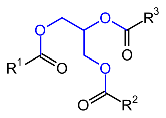

# Fett
Fette und Fette [Öle](Öl.md) sind Ester des dreiwertigen Alkohols Glycerin (Propan-1,2,3-triol mit drei [Fettsäuren](../Rohstoffe/Nahrungs_Inhaltsstoffe/Fettsäuren/Fettsäuren.md).

Man nennt solche Verbindungen Triglyceride, die IUPAC empfiehlt jedoch als Namen Triacylglycerine.

Ob man den Stoff Fett oder [Öl](Öl.md) nennt hängt davon ab ob er bei Raumtemperatur [Fest](Fest.md) oder [Flüssig](Flüssig.md) ist.

Als Naturstoffe werden Fette den Lipiden zugeordnet und sind in Lösungsmitteln wue [Petroläther](../Rohstoffe/Hochwertige_Rohstoffe/Petroläther.md), Ether und Benzol löslich.

Fette sind für den Menschen aufgrund der hohen Energiedichte der wichtigste Energiespeicher des Menschen, aber auch für Tiere und einige Pflanzenarten.

Pflanzen deponieren Fette vornehmlich in Samen oder Keimen, Tierische Organismen im Fettgewebe

# Gewinnung
Fette lassen sich entweder aus Fettgewebe schmelzen im Falle von tierischem Fett ( => [Butter](../Rohstoffe/Hochwertige_Rohstoffe/Butter.md), Schmalz, Tran) durch pressung (sog. Kaltextraktion) oder Extraktion vermittels Dampf oder oben genannten Lösungsmitteln aus Pflanzen gewinnen.

