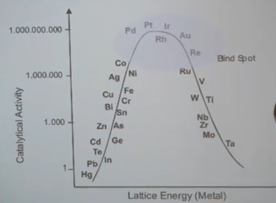

# Kathalytisch aktives Metall
was sind die wichtigsten kathalytisch aktiven Metalle in unserem Körper? 
Es folgt eine Grafik der Vulkankurve der Kathalytisch aktiven Metalle

>
>Grafik der Vulkankurve der Kathalytisch aktiven Metalle
Quelle: Nährstofflabyrinth - [Dr. Andreas Noack](../Wichtige%20Persönlichkeiten/Andreas%20Noack.md)

- Je höher in der Vulkankurve desto höher die Gitterenergie
- Je höher die Gitterenergie desto 
	- schwieriger die nutzarmachung als Bioverfügbares Nutrazeutikum
	- schwieriger die Nachweisbarkeit
	- schwieriger die Analysierbarkeit
	- weniger ist der Mensch in der Lage sie statistisch zu erfassen
	- höher der Nutzen im Biosystem
	- weniger Aufwand hat der Körper bei der Stoffsynthese eines nahezu beliebigen stoffes durch ein bestimmtes Enzym

>Der Körper kann beispielsweise ein Enzym mit Eisen oder Platin bestücken, jedoch wird er Körper bei der Verwendung des Eisenenzyms mehr Umgebungswärme benötigen als wenn dasselbe Enzym auf Platinbasis arbeitet, aufgrund der um den Faktor 1000 höheren Kathalytischen Aktivität