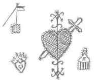

# Erzulie
Erzulie ist die Loa für Liebesangelegenheiten

## Veve

## Rituale mit Erzulie
### Liebeslampe der Erzulie
Diese Lampe ist eine Widmung für die Göttin Erzulie, welche man in Liebesangelegenheiten kontaktiert.

#### Zutaten
- 1/2 Kokosnusschale
- Docht aus Baumwolle
- 2 lange Knochensplitter
- ein wenig Rosenöl
- ein wenig Mandelöl
- 1 Blatt weißes Papier
- 1 stk Kreide
- ein wenig Draht
### Anleitung
1. man Zeichne das Veve der Erzulie auf den Boden auf die Stelle, an der künftig die Ihr geweihte Lampe stehen möge
2. Nun wird auf dieser Stelle der Draht so gebogen, dass die halbe Kokosnuss darin platz findet, sodass diese nicht versehentlich umgestoßen wird
3. Man beschrifte das Papier anschließend mit dem Namen des Wunschpartners zuerst
4. Anschließend schreibe man den Namen des Wünschenden darunter
5. Man Spreche folgendes Gebet:

> **Erzulie, sieh ich bringe dir duftendes Öl von Rosa Rosen und Süßes Öl von Mandelkernen dar. Süß wie die Liebe von (Wünschendem) zu (Wunschpartner)

6. Nun kommt das Rosenöl in die Lampe
7. Darauf folgend das Mandelöl
8. Schließlich kommt der Docht in die Lampe
9. zu letzt wird der Docht angezündet

Solange die Lampe brennt, wirkt Ihre Magie! 
Entsprechend ist es sinnvoll und wichtig zum gelingen des Zaubers daruaf zu achten, dass stets genügend Öl in der Lampe ist, sodass der Zauber größtmögliche Wirkung entfaltet