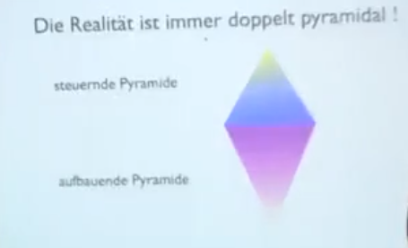
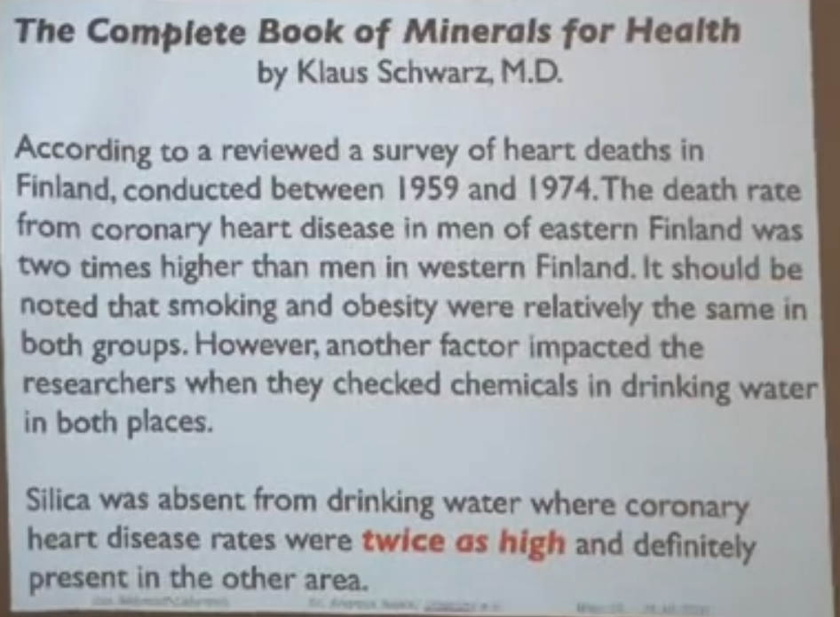
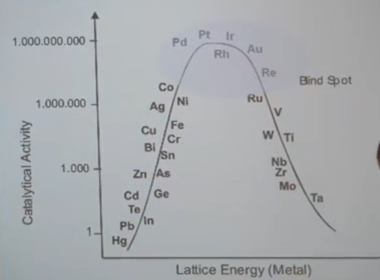

# Heilmittel der Natur

## Wasser
- Quellwasser
	+ Hunzer
	+ Colloid Minerals
	+ Lurd
- warum Quellwasser
	- enthält alle 80 natürlichen Mineralien in Bioverfügbarer Form
	- gutes Mineralwasser enthält Partikel die kleiner sind als die Zelle in die sie müssen
- saures Quellwasser
	- bedeutet, dass da mehr co² drin gelöst ist
		- hat zur folge, dass das wasser mehr Mineralien bindet und mit zu tage fördern kann
	- gutes Quellwasser hat mehr natürliches CO²
- [[Wasserstoffperoxid]]
				
	
		
		
## Salz
- Gute Salze:
	- Himalaya Salz
- warum Salz?
	- enthält alle 80 natürlichen Mineralien in Bioverfügbarer Form
	- Salz ist das Reinigungsmittel des Körpers - sein Waschwasser!!!
		
	
## Nährstoffe
### Zentrale Frage:
- wie kriegt man die Mineralstoffkonglomerate kleiner als 50nm
	- frische zubereitung
		- bei längerer wartezeit konglomerieren kolloide
			- mineralien verlieren bioverfügbarkeit
				- durch hildung von kristallstrukturen
	- natürliche nahrung ist reich an sio2
		- [[Kolloid]]e (von sio2) vermögen durch die gleichnamige elektrische ladung eine Abstoßung der Roten Blutkörperchen zueinander zu bewirken, was einen intakten Blutfluss ermöglicht, gar fördert
		- **keine [[Kolloid]]e = keine ausreichende Sauerstofftransportkapazitäten**
			- **[[Otto Warburg]]: (Sauerstoffmediziner in den 1960er Jahren)** 
				- **"80% aller Krankheiten sind das Resultat von Sauerstoff - unterversorgung"**
			- weitere Wichtige Namen
				- [[Manfred von Adrenne]]
				- [[Laszlo Fodor]]
			- **Sauerstoffpartialdruck ist relevant - nicht Sauerstoffsättigung**
			- Eine Maus kann in Flüssigkeit getaucht ewig leben, solange der TetraChlorKohlenstoff stark genug Sauerstoff eindiffudiert wird.
		- natürlich impliziert, dass ein Baum bei der Produktion der Nahrung beteiligt ist
			- Bäume werden immer Seltener in diesem Prozess
				- ist das gewollt?
			- Bäume holen die mineralien aus dem Boden und reichern diese durch verdunstung in den Blättern an welche dann zu Humus werden
					
## Wissenschaft
- alle Naturwissenschaften sind kinder der Alchemie
	- daraus folgt, dass nur der interdisziplinäre exkurs zu mehrwert führt
		- einzelkampf und wetteifern der verschiedenen Disziplinen führen in den untergang
### Der Fehler im System
- überkomplizierte lehrweisen von unqualifizierten Lehrern haben zur folge, dass der Bildngsstand sinkt.
	- Lehrer sind häufig selbst noch schüler daher unqualifizierten
		- dies hat zur Folge, dass die unterweisungen sinnloserweise übermäßig kompliziert sind
		- zum lehren sollten nur meister befugt sein, keine Amateure!
		- unzukässige verallgemeinerungen
		- Wortmanipulationen, Begriffsumdeutungen
		- unzureichende Kartographie / erklärung des Systems
		- kontraintuitiv
		- unterbewusstsein ahnt, dass die schüler **verarscht** werden
			- Resultat: **Pseudowissen**
				- **gefährlich**
				- 
### Beispiel
- Eine Himbeere enthält bis zu über 2 Mio. 	Extrahierarer Substanzen
	- Ein Ökotrophologe ist bereit 50 dieser Substanzen als relevant zu klassifizieren
		- den Rest muss er, da er nicht versteht, wass die stoffe tun als irrelevant einschätzen
### Pyramiden
- alles ist Pyramidal aufgebaut, das Fundament bildet eine Pyramide.
	- 	
	-  Wissenschaft geht vor indem bei der Analyse eines Problems die beiden Spitzen des Spektrums abgeschnitten werden und übersieht dabei wesentliche Eigenarten des beobachteten Systems
### Woran erkennt man einen guten Wissenschaftler?
- "Er weiß, dass er nichts weiß"
	- man kann nur ein Modell entwickeln
	- man kann niemals wissen wie es wirklich aussieht
	- der echte Wissenschaftler weiß genau. dass er nur Modelle entwickeln kann und mutmaßen
	- Arbeitet nach der Popperschen Philosophie
	- nach **[[Karl Popper]]**
		- Wissenschaft ist aneinanderreihung von Mutmaßungen
			- Beispiel
				- These: 
					- Alle schwäne sind weiß
					- Falsche Methode 
						- Beobachtet schwäne und zählt die weißen schwäne
						- sucht den Beweis dafür, dass es nur weiße schwäne gibt
					- richtige Methode
						- suche nach dem andersfarbigen Schwan
					- Conclusio:
						- man kann eine These nicht beweisen
						- man kann sie nur Wiederlegen
						- **Theorie macht nur sinn wenn sie wiederlegbar ist**
						- Naturgesetze sind nur spekulativ schätzbar und wollen durch wiederlegung eingegrenzt werden
					- Fotschritt:
						- Verantwortungsvolle Politik besteht aus dem _**einen großen Sprung**_, nicht kleinen Schritten
							- gleiches geht für Theorien
							- weg mit dem alten
							- Es macht mehr Sinn theorien zu töten als Menschen
							- heutige "wissenschaft" versucht lediglich dogmatisch thesen zu beweisen (in kleinen schritten)
								- man mobbt fähige und inteilligente menschen aus ihrem Job oder denunziert sie
					
					
## Der Organismus
### Hirn
- Hochleistungs Biocomputer
- Gesteuert von Bewusstsein
- vom Herzen über Induktion mit Energie versorgt
### Der Blutkreislauf zerlegt
#### Das Herz
- **keine Pumpe**
	- ergibt keinen Sinn
	- wäre das Herz eine Pumpe, müsste es nach dem **Hagen + Sollsche Gesetz** - dem **Gesetz für Laminare Strömungen** soviel Leistung aufbrigen können, dass man damit **LKW Reifen aufpumpen können müsste**
	- etwa 14bar Druck!!!
	- stark fehleranfällig
	- Langendorfsches Herz
	- Kupfer Wand Experiment
	- ist es möglich, dass viele Herzkrankeiten durch Siliziumoxidmangel in der Nahrung verursacht werden?
	- 
					
#### Das Blutgefäßsystem
- ist kein Gefäßsystem
	- ist ein Schlauchpumpensystem
	- extrem fehlerresistent
		- jede Zelle des Körpers ist beweglich		
	- Ein Elektromagneitscher Feldgenerator
	- reichert Quarz / Siliziumoxid an mit der Intention auf piezoelektrischer Bewegung beruhend einen elektromagnetischen Puls räumlich zu etablieren

				
					
## Die Nahrungsmittelproduktion
### Der Baum
- holt die Nährstoffe aus bis zu 15m tiefe aus dem Boden
- reichert die Nährstoffe in den Blättern an
	- Das Gesündeste am Kirschbaum sind seine Blätter
- Da wo der Baum fehlt
	- gibt es keine Mineralien im Boden
- Was kann man da tun?
	- Anbau von Essen auf Humusboden
	- Die asche Essen ([[Ursuppe]])
	- [[Aschedünger]]
	
## Molekulare Verbindungen
### was nicht in den Körper gehört:
#### Razemische Komplexe
- Künstlich hergestellt
- 2D strukturen werden in 3D produziert
- je nach anzahl der möglichen Richtungsänderungen in der Struktur steigt exponentiell der Prozentsatz an nicht als solche identifizierbaren Abfallprodukten

### Was der Körper braucht
#### [[Kolloid]]e
				
## Die Elemente
### Grundlegendes
- Alle Elemente des Periodensystems sind in unserem Boden
- Alle Elemente des Periodensystems sind relevant für unsere Artgerechte Entwicklung
- Alle sind Teil der Nahrung
	- Viele wurden Zurückgedrängt
	- Jedes Element hat seine Funktion
		- alle Elemente sind löslich
		- 
	- T-Zellen sind Putzer / Reinigungszellen
		- Alle wissenschaftlichen Herangehensweisen zum Thema langlebigkeit zielen darauf ab unsere Immunzellen in bestmöglicher Verfassung zu erhalten
	- Unser Immunsystem ist das Perfekte Medizinsystem
	- Wir müssen den Lagerbestand voll halten
		- Was ist die wichtigste Spezies in unserem Biochemischen Labor?
			- Enzyme...

### Enzyme
- Aufgebaut aus Proteinen							
	-  im Kern sitzt ein Edelmetall, welches die Enzymatischen Prozesse steuert
- spalet bis zu 400 000 Moleküle pro sekunde!!!
- was sind die wichtigsten kathalytisch aktiven Metalle?
	- Vulkankurve der Kathalytisch aktiven Metalle
	- 
	- je höher in der Vulkankurve desto höher die Gitterenergie
	- je höher die Gitterenergie desto schwieriger die nutzarmachung als Bioverfügbares Nutrazeutikum
- je geringer die kathalytische aktivität, desto wertloser das Enzym in dem das Element sitzt
	- Enzyme gehen kaputt dadurch
- Je höher die kathalysefähigkeiten des Elements desto mehr davon sollte man im Körper haben
	- [[Platin]], [[Gold]], [[Silber]],  [[Iridium]] & [[Rhodium]]
- Pflanzen auf Humusboden versorgen uns mit kolloidalen Metallkomplexen
											

## Es handelt sich bei allen folgenden Elementen um ihre Bioverfügbare Form, das Kolloid oder seine "Monoatomare"		Struktur	
- Monoatomare Strukturen sind nicht monoatomar, sie heißen nur so
	- Metalle sind Lebendig ! 
		- [[Etienne Szekely]]

[[Elemente des Periodensystems]]

				
# [[Vitamine]]
		
# [[Sonochemie]]
		
# [[Rezepte]]

			
		