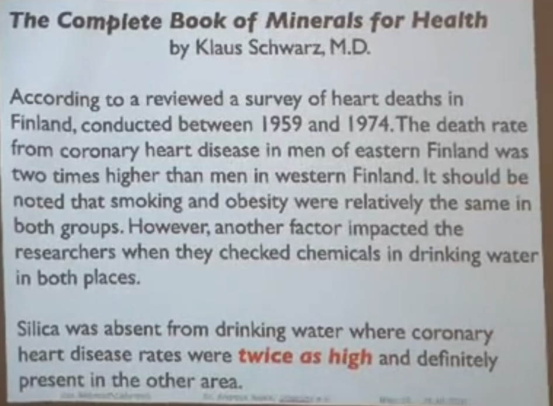

> Dies ist die [Roadmap](Roadmap.md) für das Projekt

> Das Gesamte Werk entsteht in meiner Freizeit. Du kannst mich gerne dabei unterstützen indem du den [Spendenlink](https://www.paypal.com/paypalme/jensmysl) anklickst!

> # 
 Aus gegebenem Anlass Wichtiges zur Impfung:  
 [Hier klicken](https://youtu.be/DW61NC9F2vE?t=1578)

-----------
Dieses Werk hat keinen Anspruch auf Vollständigkeit und ist KEIN Gesundheitsratgeber
-------------------
Der Autor des Inhaltes hier wendet die Angegebenen Informationen bei sich selbst an und setzt sie für sich als Erkenntnissgrundlagen voraus. Er übernimmt jedoch weder die Haftung für eventuelle Nebenwirkungen oder Schäden die durch die Anwendung dessen bem Leser entstehen mögen, noch rät der Autor davon ab ohne Rücksprache mit einem Arzt zu handeln.
 
 

Jedwede Nutzung erfolgt auf eigene Gefahr
--------------------
 
 
 
 

## Einige wundervolle Zitate

	
"Entlernen du musst, was früher du gelernt"

	
Meister Yoda

 
 

	
"Diskutiere nie mit jemandem dessen Fernseher größer ist als sein Bücherregal"

	
Emelia Clarke

 
 

	
"Deine zwei wichtigsten Investitionen für das was in den kommenden 2 bis 10 Jahren auf uns zu kommt sind: 
Ein gut trainierter Geist, der unter allen umständen klar und Ruhig bleibt
Ein starkes soziales Netzwerk, geprägt durch Solidarität, Werte und Agilität."

	
Veit Lindau

 
 

-----------------------------

<h1 style="text-align: center; font-size: 5rem;">Heilmittel der Natur</h1>

-----------------------------
# [Sonochemie](Sonochemie/Sonochemie.md)
Bevor wir uns mit irgendwie gearteten Heilmitteln aus Materiellen Gütern befassen sollten wir für einen Augenblick inne halten und uns mal kurz auf uns konzentrieren!

Halt Stop! ich meine es wirklich ernst!
Wie seht tragen wir selbst zu unserem Wohlergehen oder unserem Unglück bei?
Bitte nehmen Sie sich einen Moment Zeit und schauen Sie kurz mal in das Dokument [Sonochemie](Sonochemie/Sonochemie.md) hinein, sie werden erstaunt sein, was dort auf Sie wartet

# [Gesprächskultur](Tipps%20für%20den%20Alltag/Gesprächskultur.md)
Wie gehen Sie mit Ihren Mitmenschen um?
Wie kommen Sie zu ihren Informationen?
Ist es immer notwendig zu manipulieren? Schauen Sie selbst: [Gesprächskultur](Tipps%20für%20den%20Alltag/Gesprächskultur.md)
	
	

## [Wissenschaft](Wissenschaft.md)
					
					
## Der Organismus
### Hirn
- Hochleistungs Biocomputer
- Gesteuert von Bewusstsein
- vom Herzen über Induktion mit Energie versorgt
### Der Blutkreislauf zerlegt
#### Das Herz
- **keine Pumpe**
	- ergibt keinen Sinn
	- wäre das Herz eine Pumpe, müsste es nach dem **Hagen + Sollsche Gesetz** - dem **Gesetz für Laminare Strömungen** soviel Leistung aufbrigen können, dass man damit **LKW Reifen aufpumpen können müsste**
	- etwa 14bar Druck!!!
	- stark fehleranfällig
	- Langendorfsches Herz
	- Kupfer Wand Experiment
	- ist es möglich, dass viele Herzkrankeiten durch Siliziumoxidmangel in der Nahrung verursacht werden?
	- 
		- Quelle: Nährstofflabyrinth - Dr. Andreas Noack
					
#### Das Blutgefäßsystem
- ist kein Gefäßsystem
	- ist ein Schlauchpumpensystem
	- extrem fehlerresistent
		- jede Zelle des Körpers ist beweglich		
	- Ein Elektromagneitscher Feldgenerator
	- reichert Quarz / Siliziumoxid an mit der Intention auf piezoelektrischer Bewegung beruhend einen elektromagnetischen Puls räumlich zu etablieren

#### [Sexualität](Wichtige%20Nährstoffquellen/Sexualität.md)
				
					
## Die Nahrungsmittelproduktion
### Der Baum
- holt die Nährstoffe aus bis zu 15m tiefe aus dem Boden
- reichert die Nährstoffe in den Blättern an
	- Das Gesündeste am Kirschbaum sind seine Blätter
- Da wo der Baum fehlt
	- gibt es keine Mineralien im Boden
- Was kann man da tun?
	- Anbau von Essen auf Humusboden
	- Die asche Essen ([Ursuppe](Rezepte%20und%20Anleitungen/Ursuppe.md))
	- [Aschedünger](Rezepte%20und%20Anleitungen/Aschedünger.md)
	
## Molekulare Verbindungen
### was nicht in den Körper gehört:
#### [Razemische Komplexe](Glossar/Razemisch.md)

### Was der Körper braucht
#### [Kolloide](Glossar/Kolloid.md)
				
## Die Elemente
### Grundlegendes
- Alle Elemente des Periodensystems sind in unserem Boden
- Alle Elemente des Periodensystems sind relevant für unsere Artgerechte Entwicklung
- Alle sind Teil der Nahrung
	- Viele wurden Zurückgedrängt
	- Jedes Element hat seine Funktion
		- alle Elemente sind löslich
		- 
	- T-Zellen sind Putzer / Reinigungszellen
		- Alle wissenschaftlichen Herangehensweisen zum Thema langlebigkeit zielen darauf ab unsere Immunzellen in bestmöglicher Verfassung zu erhalten
	- Unser Immunsystem ist das Perfekte Medizinsystem
	- Wir müssen den Lagerbestand voll halten
		- Was ist die wichtigste Spezies in unserem Biochemischen Labor?
			- Enzyme...

											

## Es handelt sich bei allen folgenden Elementen um ihre Bioverfügbare Form, das Kolloid oder seine "Monoatomare"		Struktur	
- Monoatomare Strukturen sind nicht monoatomar, sie heißen nur so
	- Metalle sind Lebendig ! 
		- [Etienne Szekely](Wichtige%20Persönlichkeiten/Etienne%20Szekely.md)

### [Die Elemente des Periodensystems und ihre Wirkung auf unseren Körper](Elemente%20des%20Periodensystems/Elemente.md)

### [Nährstoffe, Vitamine und alles was zu einer gesunden Ernährung gehört](Wichtige%20Nährstoffquellen/Nährstoffe.md)

### [Heilsteine](Heilsteine/Heilsteine.md)

### [Allgemeine Tipps](Tipps%20für%20den%20Alltag/Allgemeine%20Tipps/Allgemeine%20Tipps.md)

### [Rezepte und Anleitungen](Rezepte%20und%20Anleitungen/Rezepte%20und%20Anleitungen.md)

### [Interessante Links](Interessante%20Links.md) 