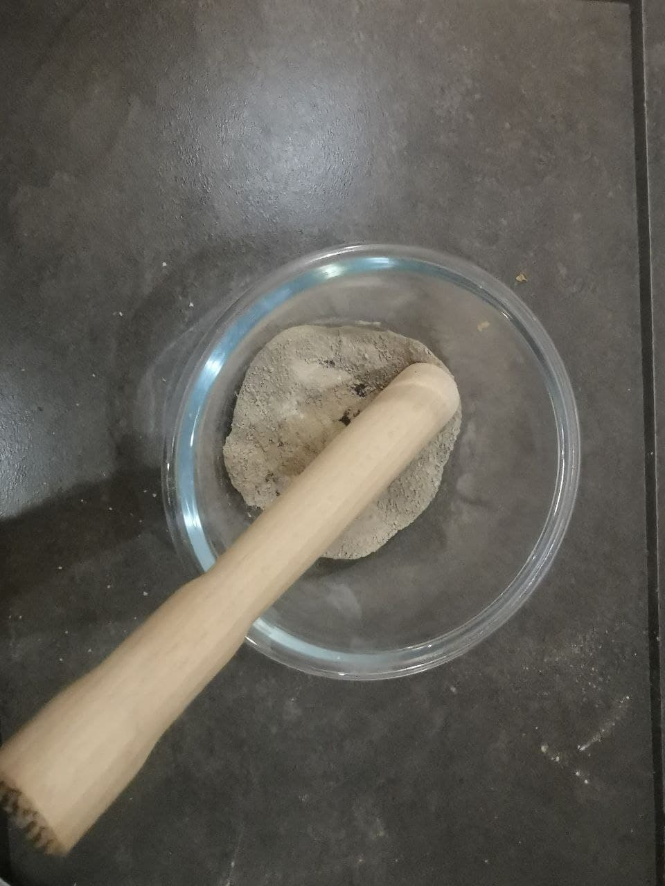

# Ursuppe (Alchemistischer Mineralcoctail)
## Quelle
Diese Rezeptur stammt vom leider im Jahre 2021 mit 58 Jahren verstorbenenen Darmstädter Chemiker, Alchemisten und Erfinder, sowie inspirator für dieses Werk: [Andreas Noack](../Wichtige_Persönlichkeiten/Andreas%20Noack.md)

### Vorbereitung
1. Holz Verbrennen
	- Holz welches Zeit hatte Mineralien anzureichern
	- Herkunft wichtiger als "Qualität"
		- am besten aus Gebirge / Höhenlage
	- Gute Holzarten
		- Zirbe, Arve, Olive
	- zur NOT geht auch verschmutztes Holz
		- Verbrennungshitze reinigt
2. Vollständig verbrannte Asche mit ca. 3- facher Menge Wasser anmischen
3. Mischung durch Baumwolltuch abfiltern
	- Bei Wiederholung größerer Yield möglich
4. Filtrat durch kochen vollständig eintrocken
5. Trockenmasse in Glas füllen und dunkel lagern!

Die Vorstufe

### Konsum des Rohproduktes
1. Eine Messerspitze Trockenmasse in ein Glas
2. Zitronensaft hinzufügen
3. Mischung schäumt auf durch Säure-Basen Reaktion
4. Glas mit [Wasser](../Stoffe/Rohstoffe/Wasser.md) auffüllen / Substrat verdünnen
5. Trinken

**Wichtig: Die Vorstufe kann je nach Holz auch Anteile der Metalle enthalten mit geringer [Kathalytischen Aktivität](../Glossar/Kathalytisch%20aktives%20Metall.md) Beispielssweise Quecksilber oder Cadmium, daher immer gutes Holz wählen**
	
### Trivia
- Substrat enthält vollständiges Mineralstoffspektrum