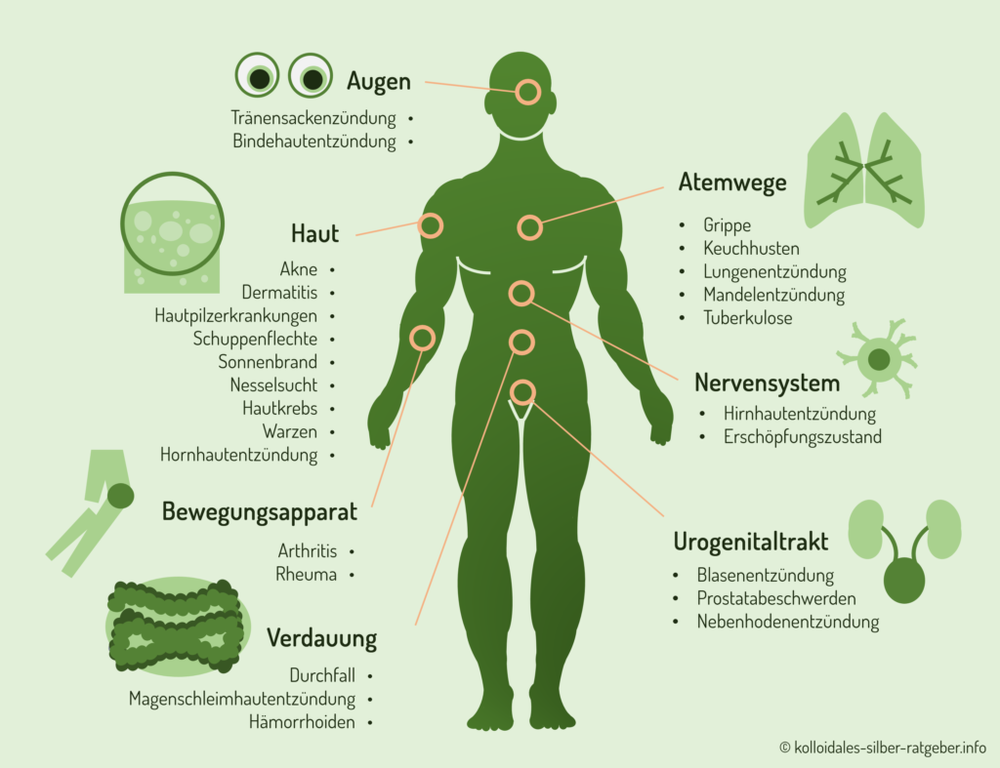

# Kolloidales Silber

## Applikationsformen:
- Gurgeln
- Mund spülen, anschließend schlucken
- Auf Wunde auftragen
- Auf Haut auftragen
- Auf Ausschlag auftragen

## Wirkung
- Silber ist Elektrisch Leitfähig
	- Die Wirksamkeit ist abhängig von den Frequenzen des Magnetischen Feldes, welches das Silber umgibt
	- Silberteilchen sind negativ geladen
		- Dies wirkt sich nachteilig auf im Körper unerwünschte Bakterien aus.
			- Blockiert die Enzyme der fremdkörper und macht sie dadurch unschädlich
			- Wirkt mitunter in 6 Minuten
			- wirkt nicht schädigend auf die Zellen des einnehmenden
	- Stärkt die Regeneration der Hautzellen
	- Wirkt gegen Haarausfall
	- Kann bei Insektenstichen Appliziert werden
	- Kann als gesunder, Verträglicher Ersatz für Antibiotika dienen
	- Kann [Kathalytisch schwache Metalle](../../Glossar/Kathalytisch%20aktives%20Metall.md) ausleiten
- Silber ist ein Oxidationskathalysator
	- Parasiten oder im Körper unerwümschte Bakterien mögen keinen Aktiven Sauerstoff
	- 

### Wirkungsspektrum
- Hautkrankheiten:
	Akne und Mitessern, Dermatitis, Rosacea, Hausausschläge, Divers, Herpesarten (Herpes simples, Gürtelrose), Furunkel
	Hautkrebs, Ekzeme, Lepra, Pest, Geschwüre, Eiterbeutel und Eiterfluss, Hautpilz, Tuberkulose, Warzen, Feigenwarzen
- bei Entzündungen des Auges:
	Bindehautentzündung, Augenlidentzündung, Tränensackentzündung, Hornhautentzündung
- Im Mundbereich:
	Zahnfleischbluten, Zahnfleischwunden, Wunden im Mund, Mundgeruch
- Bei Atemwegsentzündungen
	Husten bei Erkältung, Keuchhusten, Halsschmerzen durch Hals-, Rachenentzündung, Bronchitis, Mandelentzündung, Rhinitis (Schnupfen), Nasenschleimhautentzündung, Pleuritis (Rippenfellentzündung), Pneumonie (Lungenentzündung)
- Harn und Geschlechtskrankheiten
	Blasenentzündung, Tripper (Samenfluss), Syphilis, Nebenhodenentzündung, Prostatabeschwerden, Leukorrhoe (Scheidenausfluss), HIV
- Magen- Darmtrakt
	Durchfall, Magenschleimhautentzündung (Gastritis), Infektionen durch Salmonellen, Dickdarmentzündung, Störungen der Darmflora, Bandwurm, Dysenterie (Ruhr)
- Weitere Anwendungsmöglichkeiten
	Insektenstiche und Zeckenbisse, Haarausfall und juckender Kopfhaut, Nagelpilz und Fußpilz,  Schuppenflechten, Diabetes

### Infografik
>
>[Quelle](https://kolloidales-silber-ratgeber.info/wp-content/uploads/2018/08/Infografik-kolloidales-Silber-1024x787.png)

## Mögliche Nebenwirkungen
- Beik Silberallergie können Allergische Schocks auftreten
- Bei exorbitantem Silbergenuss kann sich die Haut grau verfärben. Dies ist irreversibel (Argyrie)
- Übliche erscheinungen bei exorbitanten Mengen:
	- Kopfschmerzen
	- Krämpfe
	- Bauchschmerzen
	- Schwindel
	- Geschmacksstörungen

## Herstellung
### Zutaten:
- [Silber](../Datenbank_Elemente_Des_Periodensystems/Silber.md)