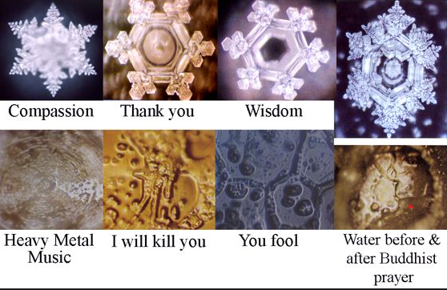

# Wasser

Die Grundlage unseres Lebens bildet ein Stoff wie kein anderer: Wasser!

Doch Wasser ist nicht gleich Wasser!
Damit ist nicht der wohl offensichtliche Unterschied zwischen Abwasser und Leitungswasser gemeint!

Wasser scheint je nach Umgebung unterschiedliche Eigenschaften an den Tag zu legen. 

Hierzu sei wärmstens die Dokumentation [Water](https://www.youtube.com/watch?v=4nYDYxXy0-U) zu empfehlen.

Einige Worte gibt es hier dennoch zu diesem unglaublich Komplexen Thema.

## Gutes Quellwasser
Wenn man das Wasser aus einer Quelle trinkt spürt man förmlich wie energiegeladen das Wasser ist. Gelegentlich spricht man hier auch von Heilwasser.
Die in diesem Zusammenhang berühmtesten Quellen sind
#### Hunzer
Die Menschen aus dem Hunzertal am Rande des Himalaya sind für ihre hohe Lebenserwartung dermaßen bekannt, dass man das Hunzertal auch "Das Tal der Hundertjährigen" nennt! Der nachgewiesenermaßen Älteste Mensch aus dem Hunzertal ist 256 Jahre alt geworden, wenngleich sicherlich seine Lebensweise viel damit zu tun hat, liegt es vermutlich auch an dem Wasser das er sein Leben lang getrunken hat - schließlich bestehen wir ja zu über 80% aus diesem Stoff
#### Colloid Minerals
#### Lurd

### Warum Quellwasser
Gutes Quellwasser enthält neben seiner besonderen "Kugelförmigen Struktur" alle 80 natürlichen Mineralien in Bioverfügbarer Form, in ihrer für unseren Organismus perfekten Menge.

Gutes Mineralwasser enthält Partikel die kleiner sind als die Zelle in die sie müssen -> [Kolloide](../../Glossar/Kolloid.md)

**Quellwasser ist immer unverzüglich spätestens innerhalb weniger Stunden zu verbrauchen**, da sonst die im Wasser gelösten Mineralstoffe um ihre Oberfläche zu vergrößern aglomerieren. Auf diese Weise gehen die in Ihm für uns wichtigen Inhaltsstoffe dadurch verloren, dass sie so nun nicht mehr von unseren Zellen aufgenommen werden können

#### Typisch Deutschland
Hier in Deutschland gibt die Trinkwasserverordnung vor, dass das Wasser gekalkt werden muss. Auf diese weise werden quasi mit Gewalt alle Mineralstoffe ausgefällt, gerade noch geringste Mengen an eisen überleben den Anstieg des PH Wertes von über 7,8.

### Sprudelwasser
Ist das Quellwasser vom PH wert her sauer, so bedeutet dies, dass in dem Wasser überdurchschnittlich viel CO2 gelöst ist.
Natürlich im Wasser gebundenes Kohlendioxid hat die für uns sehr förderliche Eigenschaft, dass der Stoff andere Mineralien aus der Erde bei seinem Aufstieg an sich bindet und so für uns Verfügbar macht

Setzen wir dem Wasser hingegen künstlich CO2 hinzu, so wie es jeden Tag Millionen von Litern Wasser geschieht, welches wir dann im Supermarkt kaufen können, so hat es keine Metalle, keine Mineralien gebunden. **Dieses Wasser entzieht und hingegen Elektrochemisch die Mineralien aus unserm Körper und ist damit bestenfalls mit Vorsicht zu genießen!**

## Die Struktur des Wasers
### Emoto Masaru
Emoto Masaru ist ein Japanischer Wissenschaftler, der sich die erforschung von Wasser zum Ziel gesetzt hatte.

#### Das Experiment
Er kam auf die Idee Wasser von der selben Quelle in von einander Isolierten Räumen einzuschließen und anschließend MEnschen zu dem Wasser zu lassen und dem Wasser jewals unterschiedliche Emotionen einzugeben.

Dieses vorgehen wurde auf unterschiedliche Weise durchgeführt, aber immer bei einer Verscuhsanordnung bestehend aus 2 oder mehr Probe auf die gleiche weise.

Mal wurde also bei einem Versuch das Wasserglas mit Aufklebern mit wörtern drauf beklebt, ein anderes mal wurde zum Wasser gesprochen, ein drittes mal bekam das Wasser Songs vorgespielt.

Im Anschluss an jeden solchen Versuch wurde das Wasser langsam abgekühlt und man erzeugte daraus Schnee.

#### Das Ergebnis
Das Ergebnis war jedoch bei allen Versuchsaufbauten gleich:
Wurde dem Wasser eine Positive Emotion oder ein Harmonisches Geschehen oder Ereignis vermittelt, so bildete das Wasser wunderschöne Sechs- oder Fünfsternige Kristalle, wie in der Grafik unterhalb zu sehen.

Sprach oder impregnierte man jedoch Angst, Hass, Furcht oder Missgunst dem Wasser gegenüber so resultierte dies in unförmigen, Chaotischen und teilweise ziemlich bizzarr aussehenden Kristallformationen.

Quelle: Emoto Masaru

#### Fragen die sich daraus Ergeben:
- Welchen Einfluss hat unsere [Gesprächskultur](../../Tipps%20für%20den%20Alltag/Gesprächskultur.md) auf unsere Gesundheit?
- Welchen Einfluss hat unsere [Gesprächskultur](../../Tipps%20für%20den%20Alltag/Gesprächskultur.md) auf unser Allgemeinwohl?
- Wären wir nicht alle deutlich näher dem Paradies wenn wir in unseren Mitmenschen die Schönheit hervorheben würden - an stelle ihrer aus unserer Sicht ungünstigen Eigenschaften?
