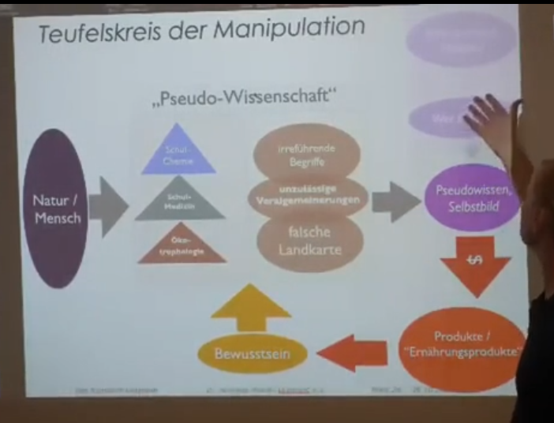

# Wissenschaft
Was ist Wissenschaft? 
Ist Wissenschaft nicht die Kraft, die Wissen schafft?
Auf welche Weise schaffen wir wissen?
Wie haben wir das früher gemacht und was hat sich daran geänder?
Spannde Fragen oder?

Es ist ein extrem umfassendes Thema aber der Autor ist um den Versuch bemüht dies vereinfacht darzustellen, obwohl er selbst kein Studierter Wisenschaftler ist, stammen seine Überlegungen von Wissenschaftlern. Darüber hinaus treibt ihn die begierde es selbst für sich zu ergründen.

## Alchemie
Der Vorläufer aller Wissenschaft ist der Wille die Natur und Ihr Wirken zu erstehen, es nachvollziehen zu können, und so benötigte es eine Lehre von allem was in der Natur wechselwirkt.
Geboren war die Alchemie, deren Ursprünge vermutlich unbekannt bleiben werden.
Die Alchemie versteht sich als die Lehre des Alls und seiner Dinge, sie ist die Wissenschaft die alles vereint.
Genaugenommen versteht die Alchemie die Naturwissenschaften als ihre Abkömmlinge, sozusagen Teilmengen des einen umfassenden ganzen.
Zusammen mit der Mathematik als ihr Werkzeug und der Philosophie als ihr geistiges Zeichenbrett bildet sich eine stabile dreieinheit heraus, deren Umfang dem einzelnen enorm erscheint.

Daraus bildeten sich die uns bekannten Naturwissenschaften heraus.
Die Idee dahinter scheint simpel. 
Jeder hat sein Fachgebiet und stellt auf diesem seine Forschungen an und durch eine große Gruppe aus Spezialisten hat man die Chance so der Glaube ein umfassendes Bild zu zeichnen.

Da jedoch jeder einzeln in seinem Fachgebiet der beste sein will, nichtzuletzt aufgrund der Tatsache, dass der Mensch dauerhaft an Energiemangel leidet und diese Energie durch [Kontrolldramen](Tipps_für_den_Alltag/Allgemeine%20Tipps/Rhetorik/Kontrolldramen/Kontrolldramen.md) nun also seinen Mitmenschen abziehen muss, weiterhin dieser Umstand nur noch den Disziplinären Spezialiste bekannt ist kommt es statt zu einer einvernehmlichen übereinstimmenden ganzheitlichen Philosophie viel mehr zu einem interdisziplinären Wettkampf in dem jeder versucht innerhalb seines Fachgebietes der beste zu sein und gleichzeitig sein Fachgebiet gegenüber seiner Kollegen als besonders elementar herauszuzeichnen. Die Folge dieser Teilung scheint also das gesamtkonstrukt in seinen Grundfesten zu erschüttern. 

Dies lässt sich recht leicht erkennen...
Dem Biologen fehlen die Chemischen, aber auch die Physikalischen kenntnisse zum verständnis des Körpers.

Dem Arzt fehlen die Chemischen, sowie die Elektrochemischen aber auch die Elektrophysikalischen Erkenntnisse, zum Verständnis wie der Körper Arbeitet. 
Der Arzt früherer Zeiten war ein Alchemist, Ihm war klar, dass wenn der dem Gegenüber [Sonochemisch](Sonochemie/Sonochemie.md) schadet - Beispielsweise ihm durch eine Diagnose Angst macht - eine Heilung deutlich erschwert wird, einem solchen Mediziner war klar, dass er stets in einer Positiven Haltung zu verbleiben hatte, dass der Patient das Wunder der Heilung selbst vollbringen würde, wenn der Arzt ihm aufzeigen würde, wie er selbst dahin kommt, gegebenenfalls noch einige [Nährstoffe](Wichtige_Nährstoffquellen/Nährstoffe.md) nachschieben würde. Es war der Medizinmann der Wusste wo die Kräuter sind, die der Patient benötigen würde. 

Ein hervoragendes Beispiel für diese Art von Medizinmann war [Paracelsus](Wichtige%20Persönlichkeiten/Paracelsus.md). Er reiste durch die Welt und fragte was er lernen konnte, nicht etwa wie er seine Approbation behalten konnte. Es war seine selbst auferlegte Pflicht die Frage nach der Ursache eines Leidens zu stellen, allein um seines interesses Willen, woraus sich jedoch zwangsläufig eine Heilmethode ergeben müsse.

So ein Verhalten ist in der heutigen "Anerkannten" Wissenschaft unüblich geworden.

### Der Fehler im System
Wir haben keine Wissenschaftler mehr im Sinne dessen was der Begriff einstmals bedeutete. Die Zentrale Idee dessen was wir Wissenschaft einst nannten bestand darin ein realistisches allgemeingültiges Modell zu entwerfen. Diejenigen die Wissenschaft praktizieren hatten einstmals im Sinne die Thesen ihrer Zunft zu wiederlegen und entsprechend neue, präzisere Modelle zu erweitern.

Ich erlaube mir mich gegebenenfalls zu Irren wenn ich behaupte, dass Wissen von Meistern ihres Gebietes weitergegeben werden sollten - doch nimmt man dies als Grundlage für weitere Stipulationen so kommt man zwangsläufig zur Erkenntnis, dass diejenigen die heutzutage die Wissensvermittlung betreiben ja nicht die Meister sind, die wir erwarten. 
Stattdessen sind es häufig selbst Schüler, denen nach Lehrplan verallgemeinerte Modelle zugrunde gelegt werden, welche möglicherweise in Teilen nicht einmal vollständig verstanden wurden.

Davon ausgehend ergibt sich eine Diskrepanz zwischen der urpsrünglichen Grundlage einer Theorie und ihrer Vermittlung die dem Stille Post Effekt gleich zu kommen scheint.

Sehr selten sind die Entwickler oder Schreiber von Lehrbüchern für die Schule - wo ja der Wesentliche Aspekt der Wissensvermittlung stattfinden soll - Experten auf Ihrem Gebiet.

Daraus ergibt sich in der Regel eine von der Praxis völlig losgelöste, mitunter extrem verkomplizierte Lehrweise, welche zudem nur Bruchstückhaft und völlig aus dem Gesamtzusammenhang gerissene "Fetzen" von Grundwissen liefert, die jedoch selten in einem Zusammenhang gesehen werden können - allein schon aufgrund der Tatsache, dass man nach Fachgebieten trennt. 

Weiterhin kommt erschwerend hinzu, dass aufgrund des Informationsverlustes von Projektion zu Projektion stets abstraktere Verallgemeinerungen Gegenstand der überlieferten Materie werden.

Dies macht es zudem einfach für Manipulation 
- Beispielsweise bei der Begriffswahl etwa durch umdeutungen von Begrifflichkeiten.
- Durch definition abstrakter Landkarten ohne einen praktischen zusammenhang (-> Das Periodensystem in der Chemie)

Welcher Schüler hat denn Lust etwas von jemandem vermittelt zu bekommen, der selbst nicht der Experte auf seinem Gebiet ist, den man erwartet anzutreffen?

Wie groß ist die Chance, dass das nachgewiesenermaßen allwissende Unterbewusstsein sich vielleicht auch bei vielen Schülern schon meldet? 
Kann dies die Ursache für den "Unmut" vieler Schüler weltweit sein?
Können die vorgehend genannten Gründe ein Teil der Ursache dessen sein, was unsere einst sehr genaue Wissenschaft zum einfallstor für Manipulateure und Geld gemacht hat?

 
Quelle: Nährstofflabyrinth - Dr. Andreas Noack

### Beispiel
Eine Himbeere enthält bis zu über 2 Mio. 	Extrahierarer Substanzen
Ein Ökotrophologe ist bereit 50 dieser Substanzen als relevant zu klassifizieren
Den Rest muss er, da er nicht versteht, was die Stoffe tun als irrelevant einschätzen.
Würde der von Herzblut getriebene Wissenschaftler nicht alles daran setzen diese Behauptung zu wiederlegen?

### Pyramiden
alles ist Pyramidal aufgebaut, das Fundament bildet eine Pyramide.
	
Quelle: Nährstofflabyrinth - Dr. Andreas Noack

Unsere Moderne Wissenschaft geht vor indem bei der Analyse eines Problems die beiden Spitzen des Spektrums abgeschnitten werden und übersieht dabei wesentliche Eigenarten des beobachteten Systems

### Woran erkennt man einen guten Wissenschaftler?
"Er weiß, dass er nichts weiß"
Man kann nur ein Modell entwickeln
Man kann niemals wissen wie es wirklich aussieht
Der echte Wissenschaftler weiß genau, dass er nur Modelle entwickeln kann und mutmaßen das diese einen Bezug zur Realität haben.

Arbeitet nach der Popperschen Philosophie
	- nach **[Karl Popper](Wichtige%20Persönlichkeiten/Karl%20Popper.md)**
		- Wissenschaft ist aneinanderreihung von Mutmaßungen
			- Beispiel
				- These: 
					- Alle schwäne sind weiß
					- Falsche Methode 
						- Beobachtet schwäne und zählt die weißen schwäne
						- sucht den Beweis dafür, dass es nur weiße schwäne gibt
					- richtige Methode
						- suche nach dem andersfarbigen Schwan
					- Conclusio:
						- man kann eine These nicht beweisen
						- man kann sie nur Wiederlegen
						- **Theorie macht nur sinn wenn sie wiederlegbar ist**
						- Naturgesetze sind nur spekulativ schätzbar und wollen durch wiederlegung eingegrenzt werden
					- Fotschritt:
						- Verantwortungsvolle Politik besteht aus dem _**einen großen Sprung**_, nicht kleinen Schritten
							- gleiches geht für Theorien
							- weg mit dem alten
							- Es macht mehr Sinn theorien zu töten als Menschen
							- heutige "wissenschaft" versucht lediglich dogmatisch thesen zu beweisen (in kleinen schritten)
								- man mobbt fähige und inteilligente menschen aus ihrem Job oder denunziert sie